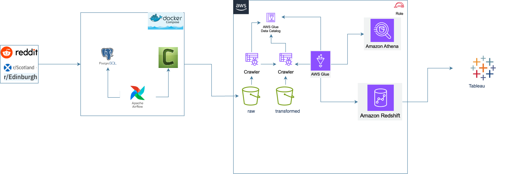

# Edinburgh Reddit E2E Data Pipeline Project

I recently finished my MSc in Data Science at Heriot-Watt University. Being an international student, I was keen to connect with the vibrant city of Edinburgh on a deeper level. To achieve this, I undertook a data engineering project that explores the vast amount of information available on the r/Edinburgh subreddit using the Reddit API. This project not only provides an exciting opportunity to apply my data engineering skills but also offers a unique perspective on the pulse of the local community and gives me insights into the current happenings around me.

This project offers a data pipeline solution that enables the extraction, transformation, and loading (ETL) of data from the Reddit (r/Edinburgh subreddit) API into a Redshift data warehouse. The pipeline utilizes tools and services such as Apache Airflow, Celery, PostgreSQL, Amazon S3, AWS Glue, and Amazon Athena, and finally, the data is visualized in a dashboard with Tableau.

## Table of Content

- [Overview](#Overview)
- [Architecture](#architecture)
- [Technologies](#technologies)
- Prerequisite

## Overview

The pipeline is designed to:

1. Extract data from r/Edinburgh subreddit using Reddit API.
2. Store the raw data into an S3 bucket from Airflow.
3. Transform the data using AWS Glue and Amazon Athena.
4. Load the transformed data into Amazon Redshift for analytics and querying.
5. Visualised the data in Tableau

## Architecture

## Technologies

- Cloud: `AWS`
- Infrastructure: `Terraform`
- Orchestration: `Airflow`
- Data lake: `Amazon S3`
- Data transformation: `Amazon Athena`
- Data warehouse: `Amazon Redshift`
- Data visualization: `Tableau`
